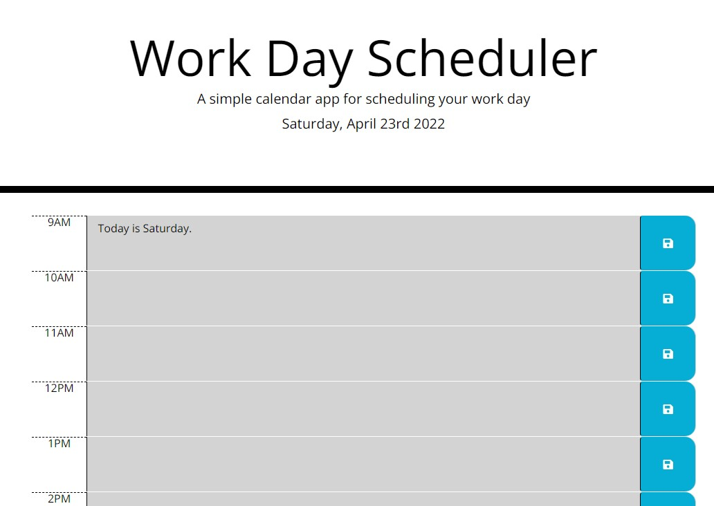

# day-scheduler

## Description

- This daily planner has 8 rows of block-time for each business hour on the day.
- It shows the current day and date at the top of the scheduler.
- The past, present, and future hours of the time block are distingushed by different colors. 
- Users can enter events in the time block and can save it to local storage. 
- The events will persist in the browser until you delet it from local storage. 

## The URL of the functional, deployed application

https://ghulamzaka.github.io/day-scheduler/

## The URL of the GitHub repository

https://github.com/GhulamZaka/day-scheduler

## Screenshoot

